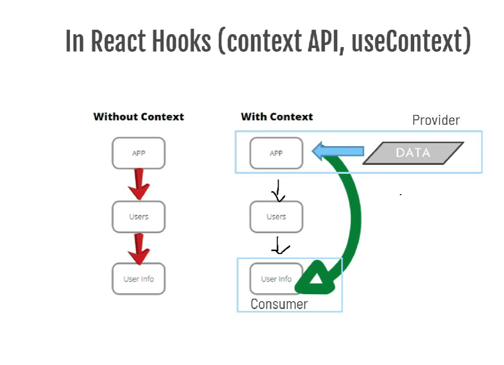

## Why Redux?


<p>The data in React always flows from parent to child component which makes it unidirectional</p>
<br/>


<p>Using React Context API and useContext hook for passing the data from provider to consumer.</p>
<br/>


<p>Using React Redux for passing data from centralised store to individual components.</p>

## What is Redux

Redux is a pattern and library for managing and updating application state using events called **actions**. It serves as a centeralised store for state that needs to be used across the entire applicationm, with rules ensuring that the state can only be updated in a **predictable** fashion.

## Redux Main Topics

### Actions(What to do)
plain JavaScript object that describes an event that has occurred in the application, such as a user clicking a button.

### Reducer(How to do)
pure function that takes the current state and an action as inputs, and returns a new state. It is responsible for updating the state based on the action.

### Store(Object which holds the state of the app)
centralized container that holds the entire application's state.

### Functions associated with store
createStore(), dispatch(action), getState()

---
## Redux Data flow


<p align="center"><a href="https://redux.js.org/tutorials/fundamentals/part-1-overview">A broad overview of Redux Data flow</a></p>

---

<br/><br/>

# REDUX BASICS:

# 1. Action (Pure Object)
Actions are plain JavaScript **objects** that have a type field. Actions only tell **what to do**, but they don't tell how to do.

E.g:
```javascript
return {
    type: 'INCREMENET'
    payload: num
}
```

Actions: Increment, Decrement

## Action Creator (Pure function which creates an action)

```javascript
export const incNumber = (num) => {
    return {
        type: 'INCREMENT',
        payload: num
    }
}
// Reusable, Portable, and Easy to Test
```

# 2. Reducer
Reducers are functions that take the **current state** and an **action** as arugments, and return a **new state** result.

```javascript
const initialState = 0;

const changeTheNumber = (state = intialState, action) => {
  switch (action.type) {
    case "INCREMENT": return state + action.payload;
    case "DECREMENT": return state - 1;
    default: return state;
  }
}
```

# 3. Store
The Redux store brings together the **state**, **actions**, and **reducers** that make up your app.

It's important to note that you'll only have a **single store** in a Redux application.

Every Redux store has a **single root** reducer function.

```js
import {createStore} from "redux";

const store = createStore(rootReducers);
```

---

<br/><br/>


# REDUX PRINCIPLES

# 1. Single source of truth
The global state of the application is stored as an object inside a single store.

# 2. State is Read-Only
The only way to change the state is to dispatch an action.

# 3. Immutability, One-way data flow, Predictability of Outcome

# 4. Changes are made with pure reducer Functions